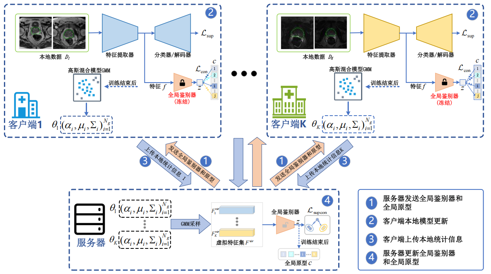
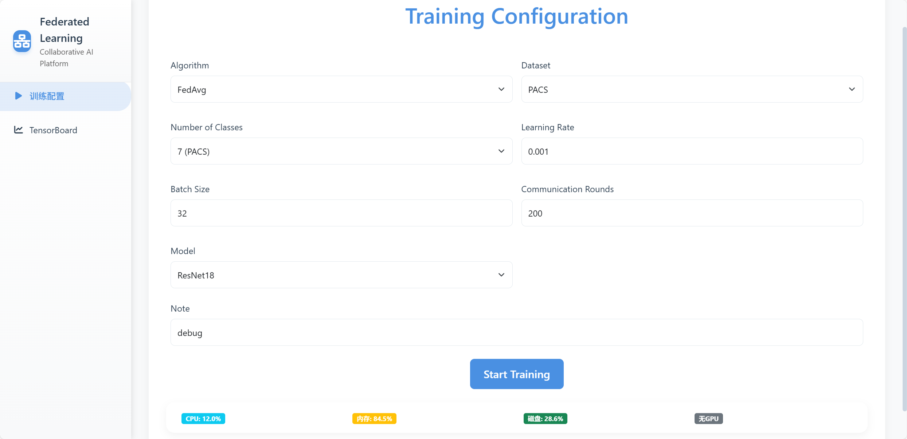
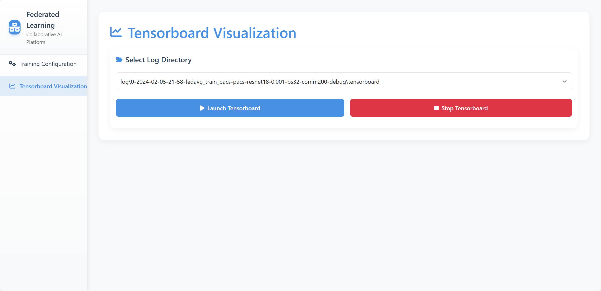

# 🌟 ACFL - Adversarial Contrastive Federated Learning

<div align="center">


</div>

<p align="center">
  
</p>

## 📖 Overview

The codes for the work "**ACFL: Communication-Efficient adversarial contrastive federated learning for medical image segmentation**". Our paper has been accepted by Knowledge-Based Systems. We provide both command-line interface and a user-friendly web interface for easy deployment and visualization.

## 🚀 Features

- 🔥 **Multiple Federated Learning Methods Implementation**:
  - FedAvg: Vanilla Federated Averaging
  - FedProx: Federated Optimization with Proximal Terms
  - SCAFFOLD: Stochastic Controlled Averaging
  - RSC: Representation Self-Challenging
  - ACFL: Our Proposed Adversarial Contrastive Method

- 📊 **Three Dataset Support for Non-IID Scenarios**:
  - **PACS**: A domain generalization benchmark with 7 categories across 4 domains (Photo, Art, Cartoon, Sketch)
  - **OfficeHome**: 65 categories across 4 diverse domains for domain adaptation
  - **TerraInc**: Wildlife recognition dataset with 10 categories demonstrating real-world distribution shifts

- 🌈 **Web Interface**: Easy-to-use GUI for:
  - Model training configuration
  - real time gpu/cpu/memory monitor
  - Real-time training visualization
  - TensorBoard log management

- 📈 **Non-IID Feature Distribution Bias**:
  - Handles domain shift challenges
  - Addresses feature distribution skew
  - Supports cross-domain generalization

- 🛠️ **Easy Deployment**: Simple setup and configuration

## 🔧 Requirements

```bash
# Core Dependencies
torch==1.11.0
torchvision==0.12.0
flask==2.0.1
tensorboard==2.11.0
```

## 📂 Dataset Preparation

1. Create directories for log files
2. Update dataset paths in `configs/default.py`:
   - `datasetpath`
     - `pacs_path`
     - `officehome_path`
     - `terrainc_path`
   - `log_count_path`

### Download Official Datasets:

| Dataset | Description | Link |
|---------|-------------|------|
| PACS | Domain Generalization | [Download](http://www.eecs.qmul.ac.uk/~dl307/project_iccv2017) |
| OfficeHome | Domain Adaptation | [Download](https://hemanthdv.github.io/officehome-dataset) |
| TerraInc | Wildlife Recognition | [Download](https://beerys.github.io/CaltechCameraTraps) |

## 💻 Usage

### Command Line Interface

You can refer to the run command in the run.sh file for startup.

```bash
# Start training/testing
sh run.sh
```

### Web Interface

Or use this simple app to start and log for visualization.

```bash
# Start the web server
python app.py
```

Then open your browser and visit: `http://localhost:5000`

#### Web Interface Features:
- 🎯 **Training Configuration**
  - Dataset selection
  - Model parameter adjustment
  - Training progress monitoring
  -  real time gpu/cpu/memory monitor
- 📊 **TensorBoard Integration**
  - Real-time metrics visualization
  - Log management
  - Performance analysis

## 🎉 Results Visualization

<div align="center">
  <table>
    <tr>
      <td align="center" width="33%">
        
        <br>
        <em>Sample Start</em>
      </td>
      <td align="center" width="33%">
        
        <br>
        <em>Tensorborad Visualization</em>
      </td>
      <td align="center" width="33%">
        
        <br>
        <em>Tensorborad Visualization</em>
      </td>
    </tr>
  </table>
</div>

## 🙏 Acknowledgement

This project has benefited from the following excellent resources:

- [FACT](https://github.com/MediaBrain-SJTU/FACT)
- [DomainBed](https://github.com/facebookresearch/DomainBed)
- [FedNova](https://github.com/JYWa/FedNova)
- [SCAFFOLD-PyTorch](https://github.com/KarhouTam/SCAFFOLD-PyTorch)

## 📝 Citation

```bibtex
@article{liang2024acfl,
  title={ACFL: Communication-Efficient adversarial contrastive federated learning for medical image segmentation},
  author={Liang, Zhiwei and Zhao, Kui and Liang, Gang and Wu, Yifei and Guo, Jinxi},
  journal={Knowledge-Based Systems},
  volume={304},
  pages={112516},
  year={2024},
  publisher={Elsevier}
}
```


## 📄 License

This project is licensed under the MIT License - see the [LICENSE](LICENSE) file for details.

